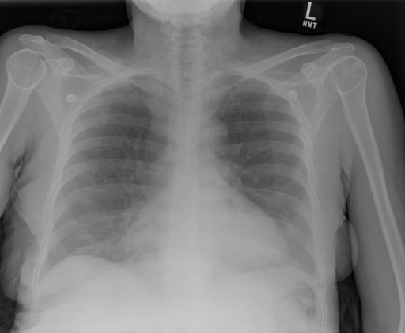
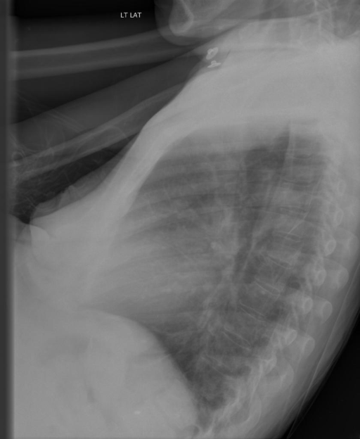

# Chest Xray Binary Classifier

## Background
Recnetly, while doing report generation task on chest xray dataset, I encounter a problem of select the frontal views from the cases in the whole dataset.
Therefore, I write a binary classifier based on pretrained resnet to solve the problem.

Usually there are two views in a chest xray case, the frontal and the left view. And my task is to extract the frontal images and copy them to a new directory.




## Dataset
IU X-RAY: a public radiography dataset collected by Indiana University with 7,470 chest X-ray images and 3,955 reports.
I labeled 2000 image manually for supervised training.

## Training and Inference

Following packages are required:
```text
torch            2.0.1+cu117
transformers     4.24.0
torchvision      0.15.2+cu117
```

Directory tree of the data is like this:
```text
# origin
oldDir
├── CXR1000_IM-0003
│   ├── 0.png
│   ├── 1.png


# destination
newDir
├── CXR1000_IM-0003
│   ├── frontal.png
│   └── left.png

```

### Training

Training on manully labeled 2000 images.

```shell
python train.py --oldDir [unlabled_case_path] --newDir [destination_path_for_labled_data] --saveDir [path_to_save_the_model]
```
Run the following command above, and I find that after 2 epoch, the model gives fantastic perfomance both on validation and test set.

```text
epoch:2
loss: train:0.04895217918405811,val:0.06401741802692414,test:0.046253756464769445
acc: train:0.9921212196350098,val:1.0,test:0.9957446455955505
```

### Inference

Inferencing on the left images in the dataset.

```shell
python inference.py --oldDir [unlabled_case_path] --newDir [destination_path_for_labled_data] --modelDir [path_to_the_saved_model]
```
